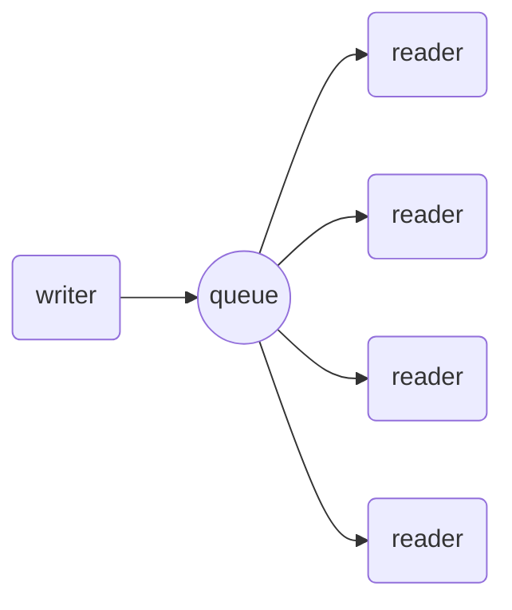
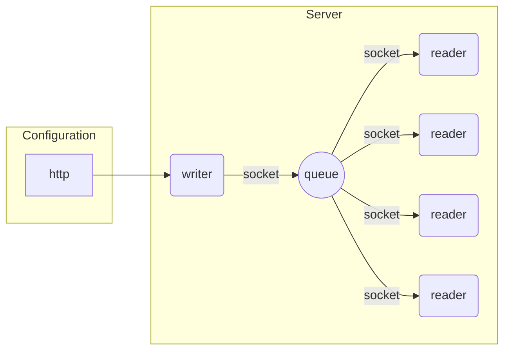
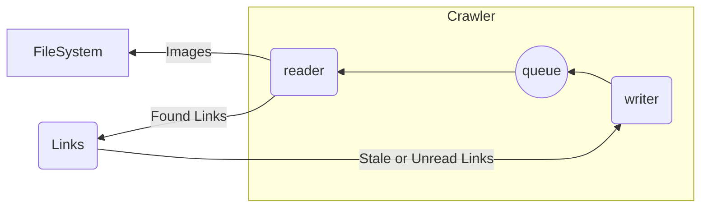
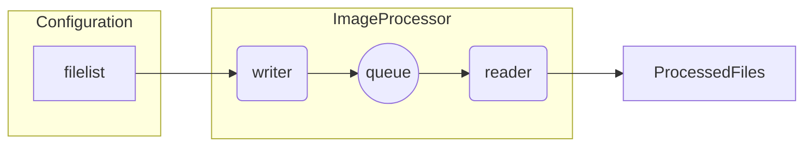

# QuasiQueue

QuasiQueue is a MultiProcessing library for Python that makes it super easy to have long running MultiProcess jobs. QuasiQueue handles process creation and cleanup, signal management, cross process communication, and all the other garbage that makes people hate dealing with multiprocessing.

QuasiQueue works by splitting the work into two components- the main process whose job it is to feed a Queue with work, and then read processes that take work off of the Queue to run. All the developers have to do is create two functions-

* `writer` is called when the queue gets low. It should return an iterable (list, generator) that QuasiQueue uses to grow the multiprocess Queue.
* `reader` is called once for each item in the Queue. It runs in a completely different process from the `writer`.



These functions can be as simple or complex as you need.

```python
import asyncio

from quasiqueue import QuasiQueue


async def writer(desired: int):
  """Feeds data to the Queue when it is low.
  """
  for x in range(0, desired):
    yield x


async def reader(identifier: int|str):
  """Receives individual items from the queue.

  Args:
      identifier (int | str): Comes from the output of the Writer function
  """
  print(f"{identifier}")


runner = QuasiQueue(
  "hello_world",
  reader=reader,
  writer=writer,
)

if __name__ == '__main__':
  asyncio.run(runner.main())
```

## Use Cases

There are a ton of use cases for QuasiQueue.

### WebServer

QuasiQueue could be the basis for a web server. The `write` function would need to feed sockets to the Queue, would would be picked up by the `reader` for handling.




### Website Image Crawler

QuasiQueue could be used to crawl a website, or series of websites, to download data.



As new pages are found they get added to a database. The write pulls pages out of the database as the queue gets smaller, and the reader adds new pages that it finds to the database. The writer function can pull links that haven't been crawled at all, and once it runs out of those it can recrawl links based on their age.

### Image Processor

QuasiQueue can be used to run large one off jobs as well, such as processing a list of images. If someone has several thousand images to process they can have the writer function feed the list into the Queue, and reader processes can take the files from the queue and run the processing needed.




## Installation

```bash
pip install quasiqueue
```


## Arguments

### Name

The first argument when initializing QuasiQueue is the name of the queue. This is used when naming new processes (which makes logging and `ps` commands a lot more useful)

### Reader

The reader function is called once per item in the queue.

```python
async def reader(identifier: int|str):
  """Receives individual items from the queue.

  Args:
      identifier (int | str): Comes from the output of the Writer function
  """
  print(f"{identifier}")
```

The reader can be extremely simple, as this one liner shows, or it can be extremely complex.

The reader can be asynchronous or synchronous. Since each reader runs in its own process there is no performance benefits to using async, but it does make it easier for projects that use a lot of async code to reuse their existing async libraries inside of the reader.

### Writer

The write function is called whenever the Queue is low. It has to return an iterator of items that can be pickled (strings, integers, or sockets are common examples) that will be feed to the Reader. Generators are a great option to reduce memory usage, but even simple lists can be returned. The writer function has to be asynchronous.

The writer function only has one argument- the desired number of items that QuasiQueue would like to retrieve and add to the Queue. This number is meant to allow for optimization on behalf of the developers- it can be completely ignored, but QuasiQueue will run more efficiently if you keep it as close the `desired` as possible.

```python
async def writer(desired: int):
  """Feeds data to the Queue when it is low.
  """
  return range(0, desired)

```

In the event that there are no items available to put in the Queue the write function should return `None`. This will signal to QuasiQueue that there is nothing for it, and it will add a slight (configurable) delay before attempting to retrieve more items.

QuasiQueue will prevent items that were recently placed in the Queue from being requeued within a configurable time frame. This is meant to make the write function more lenient- if it happens to return duplicates between calls QuasiQueue will just discard them.

### Context

The context function is completely optional. It runs once, and only once, when a new reader process is launched. It is used to initialize resources such as database pools so they can be reused between reader calls.

If the function is provided it should return a dictionary. The reader function will need to have a context argument, which will be the results from the context function. The context function can be asynchronous or synchronous.

```python

def context():
  ctx = {}
  ctx['http'] = get_http_connection_pool()
  ctx['dbengine'] = get_db_engine_pool()
  return ctx

def reader(identifier: int|str, ctx: Dict[str, Any]):
  """Receives individual items from the queue.

  Args:
      identifier (int | str): Comes from the output of the Writer function
      ctx (Dict[str, Any]): Comes from the output of the Context function
  """
  ctx['dbengine'].execute("get item")
  ctx['http'].get("url")
  print(f"{identifier}")


runner = QuasiQueue(
  "hello_world",
  reader=reader,
  writer=writer,
  context=context
)
```

Although this function is not required it can have amazing performance implications. Connection pooling of databases and websites can save a remarkable amount of resources on SSL handshakes alone.

## Settings

QuasiQueue has a variety of optimization settings that can be tweaked depending on usage.

|            Name           |  Type |                                                   Description                                                   |Default|
|---------------------------|-------|-----------------------------------------------------------------------------------------------------------------|-------|
|  `empty_queue_sleep_time` |  float|          The time in seconds that QuasiQueue will sleep the writer process when it returns no results.          |  1.0  |
|  `full_queue_sleep_time`  |  float|        The time in seconds that QuasiQueue will sleep the writer process if the queue is completely full.       |  5.0  |
|`graceful_shutdown_timeout`|integer|   The time in seconds that QuasiQueue will wait for readers to finish when it is asked to gracefully shutdown.  |   30  |
|    `lookup_block_size`    |integer|The default desired passed to the writer function. This will be adjusted lower depending on queue dynamics.|   10  |
|   `max_jobs_per_process`  |integer|               The number of jobs a reader process will run before it is replaced by a new process.              |  200  |
|      `max_queue_size`     |integer|                                       The max allowed size of the queue.                                        |  300  |
|      `num_processes`      |integer|                                      The number of reader processes to run.                                     |   2   |
|  `prevent_requeuing_time` |integer|               The time in seconds that an item will be prevented from being readded to the queue.               |  300  |
|`queue_interaction_timeout`|  float|               The time QuasiQueue will wait for the Queue to be unlocked before throwing an error.              |  0.01 |

Settings can be configured programmatically, via environment variables, or both.

### Environment Variables

All Settings can be configured via environment variables. The variables should start with the QuasiQueue name and an underscore. For example, if you named your QuasiQueue `Acme` then `ACME_NUM_PROCESS` would be used to set the number of processes.

### Programmatic

There are two methods to programmatically define the settings.

The first one is to initialize the settings and override the specific ones.

```python
from quasiqueue import Settings, QuasiQueue

QuasiQueue(
  "MyQueue",
  reader=reader,
  writer=writer,
  settings=Settings(lookup_block_size=50)
)
```

This method is simple, but the downside is that you lose the environment variable prefixes. So when using this method you have to set `NUM_PROCESSES` rather than `MYQUEUE_NUM_PROCESSES`. The work around is to extend the Settings object to give it your desired prefix.


```python
from quasiqueue import Settings, QuasiQueue
from pydantic_settings import SettingsConfigDict

class MySettings(Settings)
  model_config = SettingsConfigDict(env_prefix="MY_QUEUE_")
  lookup_block_size: int = 50

QuasiQueue(
  "MyQueue",
  reader=reader,
  writer=writer,
  settings=MySettings()
)
```

